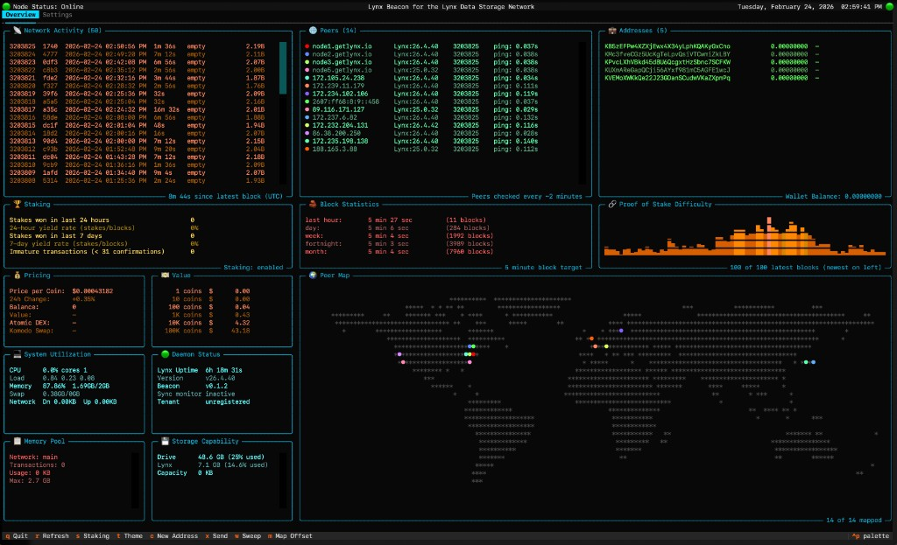

# Beacon

Beacon is a terminal management console for the Lynx Data Storage Network. It
gives stakers a single dashboard to monitor and control the blockchain projects
that power the network -- starting with the Lynx blockchain and expanding to
support up to nine chains on a single VPS or Raspberry Pi. This terminal user
interface (TUI) is built with Textual.



## Why run Beacon?

Every node strengthens the Lynx Data Storage Network. By running Beacon you help
secure the blockchain, keep the network decentralized, and earn staking rewards
in the process. Those rewards can be sold on the open market to offset your VPS
or energy costs -- turning a small server into a self-sustaining part of the
infrastructure.

Setup takes one command and about five minutes. No mining hardware, no high
energy bills -- just a VPS or Raspberry Pi.

## Join the network

```bash
bash <(curl -sL beacon.getlynx.io)
```

This installs the Lynx daemon, Beacon TUI, and all dependencies. The TUI starts
automatically on interactive SSH login. Run `beacon` manually at any time.

The node begins syncing immediately. The TUI is usable during sync and shows
progress. A sync-monitor service restarts the daemon periodically until sync completes.

## Keyboard shortcuts

| Key | Action |
|-----|--------|
| `q` | Quit |
| `r` | Refresh all data |
| `s` | Toggle staking |
| `t` | Cycle theme |
| `c` | Create new address |
| `x` | Open send card |
| `w` | Open sweep card |
| `m` | Toggle map offset |
| `u` | Apply update (only visible when an update is available) |

## Auto-update

Beacon checks for new releases on GitHub once per hour. When a newer version is
found, the header displays an update notice and the `u` key appears in the footer.
Press `u` to download and install the update, then `q` to quit and run `beacon`
to restart with the new version.

## Development

To run Beacon from the source code:

```bash
cd Beacon
./run
```

This sets up the environment and starts the TUI. Dependencies are installed automatically on first run.
